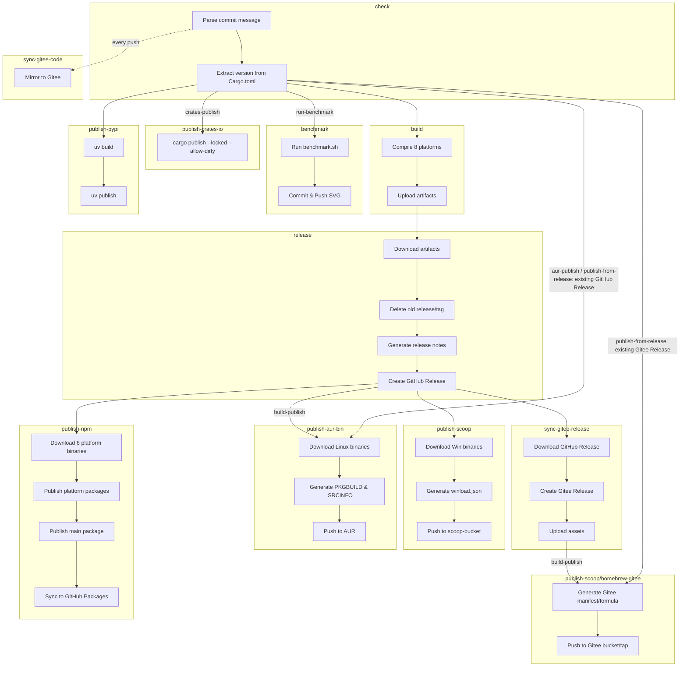

# Build & Release Workflow

> **[📖 English](build.md)**
> **[📖 简体中文(大陆)](build.zh-cn.md)**
> **[📖 繁體中文(台灣)](build.zh-tw.md)**

## 📋 Overview

The CI/CD pipeline is driven entirely by **commit message keywords**. Push to `main` with the right keyword and GitHub Actions takes care of the rest.

## 🔑 Keywords

| Keyword in commit message | Build (8 platforms) | GitHub Release | Scoop | Homebrew | AUR | npm | PyPI | crates.io | Benchmark |
|---------------------------|:---:|:---:|:---:|:---:|:---:|:---:|:---:|:---:|:---:|
| `build-action` | ✅ | ❌ | ❌ | ❌ | ❌ | ❌ | ❌ | ❌ | ❌ |
| `build-release` | ✅ | ✅ | ❌ | ❌ | ❌ | ❌ | ❌ | ❌ | ❌ |
| `build-publish` | ✅ | ✅ | ✅ | ✅ | ✅ | ✅ | ❌ | ❌ | ❌ |
| `publish-from-release` | ❌ | ❌ | ✅ | ✅ | ✅ | ✅ | ❌ | ❌ | ❌ |
| `aur-publish` | ❌ | ❌ | ❌ | ❌ | ✅ | ❌ | ❌ | ❌ | ❌ |
| `pypi-publish` | ❌ | ❌ | ❌ | ❌ | ❌ | ❌ | ✅ | ❌ | ❌ |
| `crates-publish` | ❌ | ❌ | ❌ | ❌ | ❌ | ❌ | ❌ | ✅ | ❌ |
| `run-benchmark` | ❌ | ❌ | ❌ | ❌ | ❌ | ❌ | ❌ | ❌ | ✅ |


> **Note:** `publish-from-release` publishes to Scoop, Homebrew, AUR, and npm from an existing GitHub Release without rebuilding, while `aur-publish` only republishes AUR. `build-publish` runs the full build, Release, Scoop, Homebrew, AUR, and npm pipeline.

> **Note:** Pull Requests always trigger a build (no release or publish). Commit message keywords are **ignored** for PRs — the workflow sets `should_build=true`, while `should_release` and all six publishing outputs (`should_publish_scoop`, `should_publish_homebrew`, `should_publish_aur`, `should_publish_npm`, `should_publish_pypi`, and `should_publish_crates`) are `false`.

> **Release preparation:** After changing the Rust package version or dependencies, run the following commands from the directory containing the `winload` repository to update and verify `Cargo.lock`.

```bash
cd winload/rust

cargo metadata --format-version 1 > /dev/null
cargo check --locked --no-default-features

cd ..
git status
git diff HEAD --stat
git diff HEAD -- rust/Cargo.lock
```

> **Note:** Review the lockfile diff first, then stage `rust/Cargo.lock` together with the other changes before committing and pushing.

## 🚀 Usage Examples

```bash
# ============================================================
# Single keyword
# ============================================================

# Just build, verify compilation across all platforms
git commit --allow-empty -m "ci: test cross-compile (build-action)"

# Run benchmark only
git commit --allow-empty -m "test: verify performance (run-benchmark)"

# Build + create GitHub Release (no package manager publish)
git commit -m "release: v0.2.0 (build-release)"

# Publish to Scoop/Homebrew/AUR/npm from the latest existing GitHub Release (no rebuild)
git commit --allow-empty -m "ci: publish existing release (publish-from-release)"

# Publish to AUR only from the latest existing GitHub Release (no rebuild)
git commit --allow-empty -m "ci: update aur (aur-publish)"

# Publish to crates.io only (no build, no release)
git commit --allow-empty -m "release: v0.2.0 (crates-publish)"

# Publish to PyPI only (no build, no release)
git commit --allow-empty -m "release: v0.2.0 (pypi-publish)"

# Full pipeline: build + release + publish to Scoop/Homebrew/AUR/npm
git commit -m "release: v0.2.0 (build-publish)"

# ============================================================
# Two keywords
# ============================================================

# Build + release + Scoop/Homebrew/AUR/npm + crates.io
git commit --allow-empty -m "release: v0.2.0 (build-publish, crates-publish)"

# PyPI + crates.io (no build, no release)
git commit --allow-empty -m "release: v0.2.0 (pypi-publish, crates-publish)"

# Build + release + Scoop/Homebrew/AUR/npm + PyPI
git commit --allow-empty -m "release: v0.2.0 (build-publish, pypi-publish)"

# ============================================================
# Three keywords
# ============================================================

# Full pipeline: build + release + Scoop/Homebrew/AUR/npm + PyPI + crates.io
git commit --allow-empty -m "release: v0.2.0 (build-publish, pypi-publish, crates-publish)"

# ============================================================
# Regular commits (no build, no publish)
# ============================================================

# Just update documentation
git commit -m "docs: update README"

# Fix a bug
git commit -m "fix: resolve network interface detection issue"

# Add a new feature
git commit -m "feat: add dark mode support"
```

## 🏗️ Build Targets (Rust)

| Platform | Architecture | Target | Notes |
|----------|:---:|--------|-------|
| Windows | x64 (MSVC, npcap) | `x86_64-pc-windows-msvc` | With Npcap capture support, built natively with MSVC, Windows 7+ |
| Windows | x64 (MSVC, no-npcap) | `x86_64-pc-windows-msvc` | Standalone without Npcap (`--no-default-features`), MSVC, Windows 7+ |
| Windows | ARM64 (MSVC, npcap) | `aarch64-pc-windows-msvc` | With Npcap capture, cross-compiled with MSVC, Windows 7+ (Snapdragon X/ Surface Pro X) |
| Windows | ARM64 (MSVC, no-npcap) | `aarch64-pc-windows-msvc` | Standalone without Npcap (`--no-default-features`), MSVC, Windows 7+ |
| Linux | x64 | `x86_64-unknown-linux-musl` | Built on Ubuntu runner with musl static linking, mainly for all x64 Linux distros (most cloud servers) |
| Linux | ARM64 | `aarch64-unknown-linux-gnu` | Cross-compiled on ubuntu-22.04 with gcc-aarch64, mainly for ARM64 servers / SBCs (RPi etc.) |
| macOS | x64 | `x86_64-apple-darwin` | Built on Apple Silicon runner via Rosetta, mainly for Intel Macs (2020 and earlier) |
| macOS | ARM64 | `aarch64-apple-darwin` | Built natively on Apple Silicon runner, mainly for M-series Macs (all new Macs since late 2020) |
| Android | ARM64 | `aarch64-linux-android` | Cross-compiled on Ubuntu runner with NDK (API 24), mainly for Termux on ARM phones |
| Android | x86_64 | `x86_64-linux-android` | Cross-compiled on Ubuntu runner with NDK (API 24), mainly for emulators / Chromebooks |

> **Note:** Linux targets (x64 and ARM64) also generate `.deb` and `.rpm` packages in addition to the standalone binary.

## 📦 Pipeline Stages (Rust)

```
check ──→ build ──→ release ──→ publish
  │         │         │           │
  │         │         │           ├─ Scoop: Download Win binaries
  │         │         │           │  Generate winload.json → Push to scoop-bucket
  │         │         │           │
  │         │         │           ├─ AUR: Download Linux binaries
  │         │         │           │  Generate PKGBUILD & .SRCINFO → Push to AUR
  │         │         │           │
  │         │         │           ├─ npm: Download 6 platform binaries
  │         │         │           │  Publish platform packages (os/cpu scoped)
  │         │         │           │  Publish main package (@vincentzyuapps/winload)
  │         │         │           │  Sync to GitHub Packages (npm.pkg.github.com)
  │         │         │           │
  │         │         │           └─ Gitee: Download GitHub Release assets
  │         │         │              Create Gitee Release via API
  │         │         │              Upload assets to Gitee
  │         │         │              Then update Gitee Scoop/Homebrew
  │         │         │
  │         │         └─ Download artifacts
  │         │            Delete old release/tag
  │         │            Generate release notes
  │         │            Create GitHub Release
  │         │
  │         └─ Compile for 8 platform targets
  │            Upload build artifacts
  │
  ├─→ sync-gitee-code (parallel with check, every push)
  │    Mirror all branches/tags to Gitee via hub-mirror-action
  │
  ├─→ benchmark (independent, triggered by 'run-benchmark')
  │    Run benchmark/benchmark.sh
  │    Commit & Push docs/benchmark/benchmark.svg
  │
  ├─→ publish-crates-io (triggered independently from check by 'crates-publish'; no multi-platform build)
  │    cargo publish --locked --allow-dirty
  │
  └─→ publish-pypi (independent, no build needed)
       uv build → uv publish
```

> **Note:** Release notes are auto-generated and include a download table (all platforms), quick install commands (pip/npm/cargo/scoop/AUR), and a changelog from git commits.

> **Release channels:** Only `alpha` versions are marked as pre-releases on GitHub and Gitee and published to npm with the `alpha` dist-tag. `beta`, `rc`, and stable versions are normal GitHub/Gitee Releases and use npm's `latest` dist-tag.



## 🍨 Scoop Publish (Rust)

Both `build-publish` and `publish-from-release` trigger an update to the [scoop-bucket](https://github.com/VincentZyuApps/scoop-bucket) repository:

1. Downloads Windows x64 and ARM64 binaries from the latest GitHub Release
2. Computes SHA256 hashes
3. Generates `winload.json` manifest (with both `64bit` and `arm64` architecture support)
4. Pushes to `VincentZyuApps/scoop-bucket`

## 🐧 AUR Publish (Rust)

`build-publish` updates the AUR package [winload-rust-bin](https://aur.archlinux.org/packages/winload-rust-bin) after building and creating a new GitHub Release. Both `publish-from-release` and `aur-publish` can update AUR from an existing GitHub Release without rebuilding; `aur-publish` is the AUR-only trigger.

1. Downloads Linux x64 and ARM64 binaries from the latest GitHub Release
2. Computes SHA256 hashes
3. Generates `PKGBUILD` and `.SRCINFO`
4. Pushes to AUR via SSH

### Prerequisite

A repository secret `AUR_SSH_KEY` must be set in **Settings → Secrets → Actions**, containing the private SSH key for the AUR user.

## 📦 npm Publish (Rust)

Both `build-publish` and `publish-from-release` trigger publishing to npm as [`@vincentzyuapps/winload`](https://www.npmjs.com/package/@vincentzyuapps/winload):

1. Downloads 6 platform binaries (Win/Linux/macOS × x64/ARM64) from the latest GitHub Release
2. Publishes 6 platform-specific packages with `os`/`cpu` fields (npm auto-selects the matching one)
3. Publishes the main `@vincentzyuapps/winload` package with `optionalDependencies`
4. `alpha` versions use the npm `alpha` dist-tag; `beta`, `rc`, and stable versions use `latest`
5. Syncs all packages to [GitHub Packages](https://github.com/features/packages) (`npm.pkg.github.com`)

> Uses the [esbuild](https://github.com/evanw/esbuild) / [Biome](https://github.com/biomejs/biome) pattern: each platform has its own scoped package, `optionalDependencies` ensures only the matching binary is downloaded.

> The old unscoped package `winload-rust-bin` has been deprecated. The scoped name `@vincentzyuapps/winload` is required for GitHub Packages compatibility.

### Prerequisite

A repository secret `NPM_TOKEN` must be set in **Settings → Secrets → Actions**, containing an npm Automation token.

> **Note:** GitHub Packages publishing uses `GITHUB_TOKEN` which is automatically provided by GitHub Actions — no additional secret is needed.

## 🐍 PyPI Publish (Python)

The `pypi-publish` keyword triggers publishing the Python package to PyPI:

1. Installs `uv` via [astral-sh/setup-uv](https://github.com/astral-sh/setup-uv)
2. Builds the package using `uv build` in the `python/` directory
3. Publishes to PyPI using `uv publish`

### Prerequisite

A repository secret `PYPI_TOKEN` must be set in **Settings → Secrets → Actions**, containing a PyPI API token with "Entire account" scope.

## 📦 crates.io Publish (Rust)

The `crates-publish` keyword triggers publishing the Rust crate to [crates.io](https://crates.io/crates/winload):

1. Installs Rust stable toolchain
2. Runs `cargo publish --locked --allow-dirty` to publish to crates.io
3. Users can install via `cargo install winload`

### Prerequisite

A repository secret `CARGO_REGISTRY_TOKEN` must be set in **Settings → Secrets → Actions**, containing a crates.io API token.

> **Note:** This job is independently triggered from `check` by `crates-publish`; it does not wait for the multi-platform build or binary Release jobs.

## 🔄 Gitee Sync

Automatically mirrors code and releases to [Gitee](https://gitee.com/vincent-zyu/winload) (Chinese GitHub alternative).

### sync-gitee-code — Code Mirror

Runs **on every push** (parallel with `check` job):
- Uses [Yikun/hub-mirror-action](https://github.com/Yikun/hub-mirror-action) to mirror all branches, tags, and commits
- Triggered automatically, no keyword needed

### sync-gitee-release — Release Mirror

Runs **after `release` job succeeds** (parallel with GitHub-side package publishing):
1. Downloads all assets from the GitHub Release
2. Creates a corresponding Release on Gitee via API
3. Uploads all binary assets to Gitee Release

When `build-publish` creates a fresh Release, Gitee Scoop and Gitee Homebrew wait for this mirror job to succeed before pointing manifests/formulae at Gitee assets. `publish-from-release` keeps using the existing Gitee Release directly and does not force this mirror job first.

### Prerequisites

| Secret | Where to get | Purpose |
|--------|--------------|---------|
| `GITEE_PRIVATE_KEY` | SSH key pair (see [setup guide](../../docs/dev/commit和release从github同步到gitee捏.md)) | Push code via hub-mirror-action |
| `GITEE_TOKEN` | [Gitee Personal Access Token](https://gitee.com/profile/personal_access_tokens) | Create Release & upload assets via API |

> **Note:** For detailed setup instructions, see [commit和release从github同步到gitee捏.md](../../docs/dev/commit和release从github同步到gitee捏.md).

## 📌 Version

The version is automatically extracted from `rust/Cargo.toml` (Rust) or `python/pyproject.toml` (Python) and used for:
- Release tag name (e.g. `v0.1.5`)
- Artifact filenames (e.g. `winload-windows-x86_64-msvc-npcap-v0.1.5.exe`)
- Scoop/AUR/npm/PyPI/crates.io manifest version field

> **Note:** The npm package version also comes from `rust/Cargo.toml`. During CI, the `publish-npm` job dynamically injects the version into `package.json` — the `0.0.0` placeholder in the repository is never published.

## ⚙️ Prerequisites Summary

| Secret | Where to get | Purpose |
|--------|--------------|---------|
| `SCOOP_BUCKET_TOKEN` | GitHub PAT with `repo` scope | Push to Scoop bucket |
| `AUR_SSH_KEY` | AUR user SSH private key | Push to AUR |
| `NPM_TOKEN` | npm Automation token | Publish to npm |
| `PYPI_TOKEN` | PyPI API token (Scope: "Entire account") | Push to PyPI |
| `CARGO_REGISTRY_TOKEN` | crates.io API token | Publish to crates.io |
| `GITEE_PRIVATE_KEY` | SSH private key for Gitee | Mirror code to Gitee |
| `GITEE_TOKEN` | Gitee Personal Access Token | Create Gitee releases |
