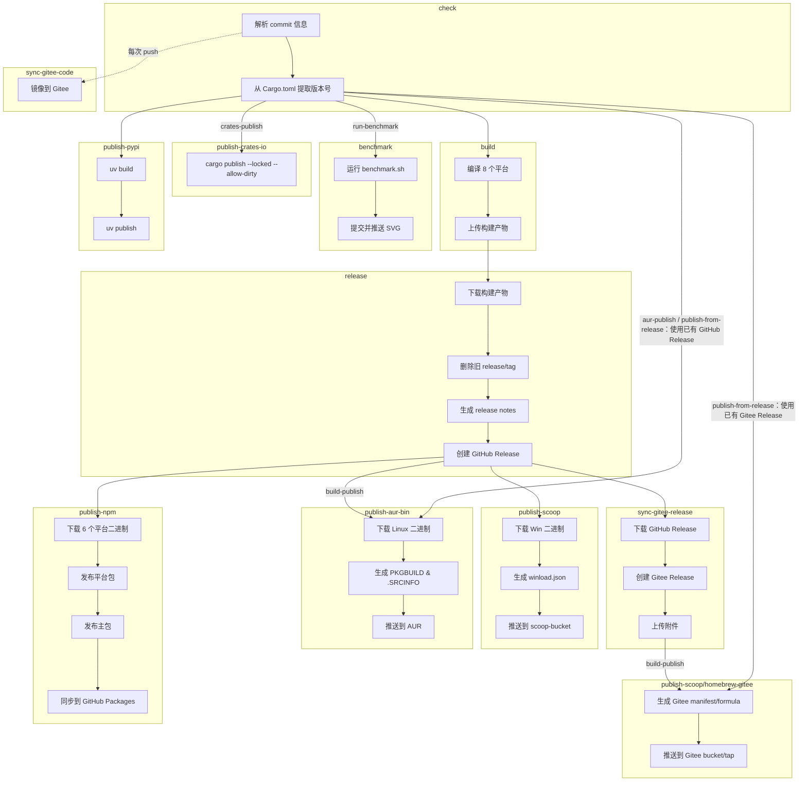

# 构建与发布工作流

> **[📖 English](build.md)**
> **[📖 简体中文(大陆)](build.zh-cn.md)**
> **[📖 繁體中文(台灣)](build.zh-tw.md)**

## 📋 概述

CI/CD 流水线完全由 **commit 信息中的关键词** 驱动。推送到 `main` 分支时，只需在 commit message 中包含对应关键词，GitHub Actions 会自动完成后续工作。

## 🔑 关键词

| Commit 信息中的关键词 | 构建（8 平台） | GitHub Release | Scoop | Homebrew | AUR | npm | PyPI | crates.io | 基准测试 (Benchmark) |
|----------------------|:---:|:---:|:---:|:---:|:---:|:---:|:---:|:---:|:---:|
| `build-action` | ✅ | ❌ | ❌ | ❌ | ❌ | ❌ | ❌ | ❌ | ❌ |
| `build-release` | ✅ | ✅ | ❌ | ❌ | ❌ | ❌ | ❌ | ❌ | ❌ |
| `build-publish` | ✅ | ✅ | ✅ | ✅ | ✅ | ✅ | ❌ | ❌ | ❌ |
| `publish-from-release` | ❌ | ❌ | ✅ | ✅ | ✅ | ✅ | ❌ | ❌ | ❌ |
| `aur-publish` | ❌ | ❌ | ❌ | ❌ | ✅ | ❌ | ❌ | ❌ | ❌ |
| `pypi-publish` | ❌ | ❌ | ❌ | ❌ | ❌ | ❌ | ✅ | ❌ | ❌ |
| `crates-publish` | ❌ | ❌ | ❌ | ❌ | ❌ | ❌ | ❌ | ✅ | ❌ |
| `run-benchmark` | ❌ | ❌ | ❌ | ❌ | ❌ | ❌ | ❌ | ❌ | ✅ |


> **说明:** `publish-from-release` 从已有的 GitHub Release 发布到 Scoop、Homebrew、AUR 和 npm，不会重新构建；`aur-publish` 则只补发 AUR。`build-publish` 会执行构建、Release、Scoop、Homebrew、AUR 和 npm 的完整流水线。

> **说明:** Pull Request 始终会触发构建（不会发布或推送包管理器）。PR 中 commit message 的关键词会被**忽略**——工作流设置 `should_build=true`，而 `should_release` 和六个发布输出（`should_publish_scoop`、`should_publish_homebrew`、`should_publish_aur`、`should_publish_npm`、`should_publish_pypi`、`should_publish_crates`）均为 `false`。

> **发布前检查：** 修改 Rust 包版本或依赖后，请从包含 `winload` 仓库的目录运行以下命令，以更新并验证 `Cargo.lock`。

```bash
cd winload/rust

cargo metadata --format-version 1 > /dev/null
cargo check --locked --no-default-features

cd ..
git status
git diff HEAD --stat
git diff HEAD -- rust/Cargo.lock
```

> **说明：** 请先检查锁文件差异，确认无误后再将 `rust/Cargo.lock` 与其他的变更一起暂存、提交并推送。

## 🚀 用法示例

```bash
# ============================================================
# 单个关键词
# ============================================================

# 仅构建，验证所有平台的编译
git commit --allow-empty -m "ci: test cross-compile (build-action)"

# 仅运行基准测试
git commit --allow-empty -m "test: verify performance (run-benchmark)"

# 构建 + 创建 GitHub Release（不发布到包管理器）
git commit -m "release: v0.2.0 (build-release)"

# 从已有的最新 GitHub Release 发布到 Scoop/Homebrew/AUR/npm（不重新构建）
git commit --allow-empty -m "ci: publish existing release (publish-from-release)"

# 仅从已有的最新 GitHub Release 发布到 AUR（不重新构建）
git commit --allow-empty -m "ci: update aur (aur-publish)"

# 仅发布到 crates.io（不构建，不发布 Release）
git commit --allow-empty -m "release: v0.2.0 (crates-publish)"

# 仅发布到 PyPI（不构建，不发布 Release）
git commit --allow-empty -m "release: v0.2.0 (pypi-publish)"

# 完整流水线：构建 + Release + 发布到 Scoop/Homebrew/AUR/npm
git commit -m "release: v0.2.0 (build-publish)"

# ============================================================
# 两个关键词组合
# ============================================================

# 构建 + Release + Scoop/Homebrew/AUR/npm + crates.io
git commit --allow-empty -m "release: v0.2.0 (build-publish, crates-publish)"

# PyPI + crates.io（不构建，不发布 Release）
git commit --allow-empty -m "release: v0.2.0 (pypi-publish, crates-publish)"

# 构建 + Release + Scoop/Homebrew/AUR/npm + PyPI
git commit --allow-empty -m "release: v0.2.0 (build-publish, pypi-publish)"

# ============================================================
# 三个关键词组合
# ============================================================

# 完整流水线：构建 + Release + Scoop/Homebrew/AUR/npm + PyPI + crates.io
git commit --allow-empty -m "release: v0.2.0 (build-publish, pypi-publish, crates-publish)"

# ============================================================
# 常规 commit（不需要构建和发布）
# ============================================================

# 仅更新文档
git commit -m "docs: update README"

# 修复 bug
git commit -m "fix: resolve network interface detection issue"

# 添加新功能
git commit -m "feat: add dark mode support"
```

## 🏗️ 构建目标 (Rust)

| 平台 | 架构 | Target | 说明 |
|------|:---:|--------|------|
| Windows | x64 (MSVC, npcap) | `x86_64-pc-windows-msvc` | 带 Npcap 抓包支持，原生 MSVC 编译，Windows 7+ |
| Windows | x64 (MSVC, no-npcap) | `x86_64-pc-windows-msvc` | 无 Npcap 独立二进制 (`--no-default-features`)，MSVC，Windows 7+ |
| Windows | ARM64 (MSVC, npcap) | `aarch64-pc-windows-msvc` | 带 Npcap 抓包，MSVC 交叉编译，Windows 7+（骁龙 X / Surface Pro X） |
| Windows | ARM64 (MSVC, no-npcap) | `aarch64-pc-windows-msvc` | 无 Npcap 独立二进制 (`--no-default-features`)，MSVC，Windows 7+ |
| Linux | x64 | `x86_64-unknown-linux-musl` | 在 Ubuntu runner 上用 musl 静态链接编译，主要用于所有 x64 Linux 发行版（大部分云服务器） |
| Linux | ARM64 | `aarch64-unknown-linux-gnu` | 在 ubuntu-22.04 上用 gcc-aarch64 交叉编译，主要用于 ARM64 服务器 / 单片机（树莓派等） |
| macOS | x64 | `x86_64-apple-darwin` | 在 Apple Silicon runner 上通过 Rosetta 编译，主要用于 Intel Mac（2020 年及更早的老款 Mac） |
| macOS | ARM64 | `aarch64-apple-darwin` | 在 Apple Silicon runner 上原生编译，主要用于 M 系列 Mac（2020 年末至今的所有新款 Mac） |
| Android | ARM64 | `aarch64-linux-android` | 在 Ubuntu runner 上用 NDK（API 24）交叉编译，主要用于 Termux（ARM 手机） |
| Android | x86_64 | `x86_64-linux-android` | 在 Ubuntu runner 上用 NDK（API 24）交叉编译，主要用于模拟器 / Chromebook |

> **说明：** Linux 目标（x64 和 ARM64）除了生成独立二进制文件外，还会额外生成 `.deb` 和 `.rpm` 包。

## 📦 流水线阶段 (Rust)

```
check ──→ build ──→ release ──→ publish
  │         │         │           │
  │         │         │           ├─ Scoop: 从 Release 下载 Win 二进制
  │         │         │           │  生成 winload.json → 推送到 scoop-bucket
  │         │         │           │
  │         │         │           ├─ AUR: 从 Release 下载 Linux 二进制
  │         │         │           │  生成 PKGBUILD & .SRCINFO → 推送到 AUR
  │         │         │           │
  │         │         │           ├─ npm: 从 Release 下载 6 个平台二进制
  │         │         │           │  发布平台包 (os/cpu 限定)
  │         │         │           │  发布主包 (@vincentzyuapps/winload)
  │         │         │           │  同步到 GitHub Packages (npm.pkg.github.com)
  │         │         │           │
  │         │         │           └─ Gitee: 从 GitHub Release 下载附件
  │         │         │              通过 Gitee API 创建 Release
  │         │         │              上传附件到 Gitee
  │         │         │              然后更新 Gitee Scoop/Homebrew
  │         │         │
  │         │         └─ 下载构建产物
  │         │            删除旧的 release/tag
  │         │            生成 release notes
  │         │            创建 GitHub Release
  │         │
  │         └─ 编译 8 个平台目标
  │            上传构建产物
  │
  ├─→ sync-gitee-code（与 check 并行，每次 push 触发）
  │    通过 hub-mirror-action 镜像所有分支/标签到 Gitee
  │
  ├─→ benchmark（独立运行，'run-benchmark' 触发）
  │    运行 benchmark/benchmark.sh
  │    提交并推送 docs/benchmark/benchmark.svg
  │
  ├─→ publish-crates-io（从 check 独立触发，'crates-publish'；无需多平台构建）
  │    cargo publish --locked --allow-dirty
  │
  └─→ publish-pypi（独立运行，不需要构建）
       uv build → uv publish
```

> **说明：** Release Notes 自动生成，包含下载表格（所有平台）、快速安装命令（pip/npm/cargo/scoop/AUR）以及来自 git commits 的变更日志。

> **发布渠道：** 只有 `alpha` 版本会在 GitHub 和 Gitee 标记为预发布，并使用 npm 的 `alpha` dist-tag。`beta`、`rc` 和稳定版均为普通 GitHub/Gitee Release，并使用 npm 的 `latest` dist-tag。



## 🍨 Scoop 发布 (Rust)

`build-publish` 和 `publish-from-release` 都会触发 [scoop-bucket](https://github.com/VincentZyuApps/scoop-bucket) 仓库的更新：

1. 从最新的 GitHub Release 下载 Windows x64 和 ARM64 二进制文件
2. 计算 SHA256 哈希值
3. 生成 `winload.json` 清单文件（包含 `64bit` 和 `arm64` 两种架构）
4. 推送到 `VincentZyuApps/scoop-bucket` 仓库

## 🐧 AUR 发布 (Rust)

`build-publish` 会在构建并创建新的 GitHub Release 后更新 AUR 包 [winload-rust-bin](https://aur.archlinux.org/packages/winload-rust-bin)。`publish-from-release` 和 `aur-publish` 都可以从已有的 GitHub Release 更新 AUR 且不会重新构建；`aur-publish` 是仅发布 AUR 的触发词。

1. 从最新的 GitHub Release 下载 Linux x64 和 ARM64 二进制文件
2. 计算 SHA256 哈希值
3. 生成 `PKGBUILD` 和 `.SRCINFO`
4. 通过 SSH 推送到 AUR

### 前置条件

需要在仓库的 **Settings → Secrets → Actions** 中设置 `AUR_SSH_KEY` 密钥，值为 AUR 用户的 SSH 私钥。

## 📦 npm 发布 (Rust)

`build-publish` 和 `publish-from-release` 都会触发将 Rust 预编译二进制发布到 npm，包名为 [`@vincentzyuapps/winload`](https://www.npmjs.com/package/@vincentzyuapps/winload)：

1. 从最新的 GitHub Release 下载 6 个平台的二进制文件（Win/Linux/macOS × x64/ARM64）
2. 发布 6 个平台专属包，每个包带有 `os`/`cpu` 字段（npm 自动选择匹配的包）
3. 发布主包 `@vincentzyuapps/winload`，通过 `optionalDependencies` 引用各平台包
4. `alpha` 版本使用 npm 的 `alpha` dist-tag；`beta`、`rc` 和稳定版使用 `latest`
5. 同步发布到 [GitHub Packages](https://github.com/features/packages)（`npm.pkg.github.com`）

> 采用 [esbuild](https://github.com/evanw/esbuild) / [Biome](https://github.com/biomejs/biome) 模式：每个平台一个独立包，`optionalDependencies` 确保只下载匹配当前平台的二进制。

> 旧的非 scoped 包名 `winload-rust-bin` 已弃用。改用 `@vincentzyuapps/winload` 是为了兼容 GitHub Packages 规范。

### 前置条件

需要在仓库的 **Settings → Secrets → Actions** 中设置 `NPM_TOKEN` 密钥，值为 npm Automation Token。

> **注意：** GitHub Packages 发布使用 `GITHUB_TOKEN`，由 GitHub Actions 自动提供，无需额外设置密钥。

## 🐍 PyPI 发布 (Python)

`pypi-publish` 关键词会触发将 Python 包发布到 PyPI：

1. 通过 [astral-sh/setup-uv](https://github.com/astral-sh/setup-uv) 安装 `uv`
2. 在 `python/` 目录下使用 `uv build` 构建包
3. 使用 `uv publish` 发布到 PyPI

### 前置条件

需要在仓库的 **Settings → Secrets → Actions** 中设置 `PYPI_TOKEN` 密钥，值为一个拥有 "Entire account" 权限的 PyPI API Token。

## 📦 crates.io 发布 (Rust)

`crates-publish` 关键词会触发将 Rust 包发布到 [crates.io](https://crates.io/crates/winload)：

1. 安装 Rust stable 工具链
2. 运行 `cargo publish --locked --allow-dirty` 发布到 crates.io
3. 用户可以通过 `cargo install winload` 安装

### 前置条件

需要在仓库的 **Settings → Secrets → Actions** 中设置 `CARGO_REGISTRY_TOKEN` 密钥，值为 crates.io API Token。

> **注意：** 此任务由 `crates-publish` 从 `check` 独立触发，不会等待多平台构建或二进制 Release 任务。

## 🔄 Gitee 同步

自动将代码和 Release 镜像到 [Gitee](https://gitee.com/vincent-zyu/winload)（国内 GitHub 替代）。

### sync-gitee-code — 代码镜像

**每次 push 时运行**（与 `check` job 并行）：
- 使用 [Yikun/hub-mirror-action](https://github.com/Yikun/hub-mirror-action) 镜像所有分支、标签和提交
- 自动触发，无需关键词

### sync-gitee-release — Release 镜像

**在 `release` job 成功后运行**（与 GitHub 侧包发布并行）：
1. 下载 GitHub Release 的所有附件
2. 通过 API 在 Gitee 上创建对应的 Release
3. 上传所有二进制附件到 Gitee Release

当 `build-publish` 创建全新的 Release 时，Gitee Scoop 和 Gitee Homebrew 会等待此镜像任务成功后，再把 manifest/formula 指向 Gitee 附件。`publish-from-release` 会继续直接使用已有的 Gitee Release，不强制先运行此镜像任务。

### 前置条件

| 密钥 | 获取方式 | 用途 |
|------|----------|------|
| `GITEE_PRIVATE_KEY` | SSH 密钥对（参见 [配置指南](../../docs/dev/commit和release从github同步到gitee捏.md)） | 通过 hub-mirror-action 推送代码 |
| `GITEE_TOKEN` | [Gitee 个人访问令牌](https://gitee.com/profile/personal_access_tokens) | 通过 API 创建 Release 和上传附件 |

> **注意：** 详细配置步骤请参见 [commit和release从github同步到gitee捏.md](../../docs/dev/commit和release从github同步到gitee捏.md)。

## 📌 版本号

版本号自动从 `rust/Cargo.toml` (Rust) 或 `python/pyproject.toml` (Python) 中提取，用于：
- Release 标签名（如 `v0.1.5`）
- 产物文件名（如 `winload-windows-x86_64-msvc-npcap-v0.1.5.exe`）
- Scoop/AUR/npm/PyPI/crates.io 清单文件中的版本字段

> **注意：** npm 包的版本号同样来自 `rust/Cargo.toml`。CI 中 `publish-npm` 任务会在发布前将版本号动态注入 `package.json` —— 仓库中的 `0.0.0` 占位符不会被发布。

## ⚙️ 前置条件汇总

| 密钥 | 获取方式 | 用途 |
|------|----------|------|
| `SCOOP_BUCKET_TOKEN` | GitHub PAT（需 `repo` 权限） | 推送到 Scoop bucket |
| `AUR_SSH_KEY` | AUR 用户 SSH 私钥 | 推送到 AUR |
| `NPM_TOKEN` | npm Automation Token | 发布到 npm |
| `PYPI_TOKEN` | PyPI API Token（Scope: "Entire account"） | 推送到 PyPI |
| `CARGO_REGISTRY_TOKEN` | crates.io API Token | 发布到 crates.io |
| `GITEE_PRIVATE_KEY` | Gitee SSH 私钥 | 镜像代码到 Gitee |
| `GITEE_TOKEN` | Gitee 个人访问令牌 | 创建 Gitee releases |
