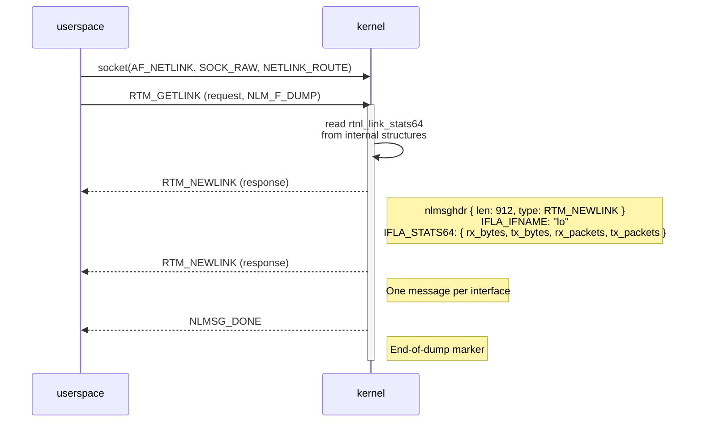
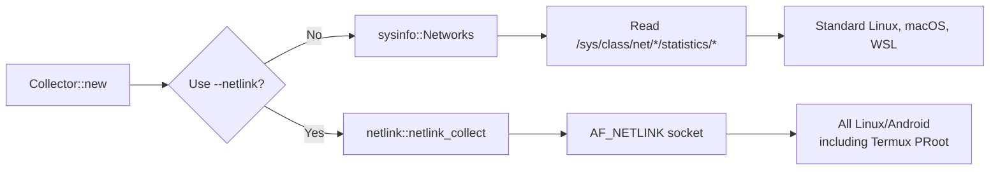

# Linux & Android Network Statistics: From sysfs to Netlink

> **[📖 English](linux_android_netlink.md)**
> **[📖 简体中文(大陆)](linux_android_netlink.zh-cn.md)**
> **[📖 繁體中文(台灣)](linux_android_netlink.zh-tw.md)**

## ⚡ TL;DR

Linux provides **two distinct pathways** for reading network interface traffic statistics:

1. **sysfs (default, used by `sysinfo` crate)** — reads `/sys/class/net/<iface>/statistics/*` files. Follows the "everything is a file" philosophy. Simple, reliable, works everywhere — **except when it doesn't**.
2. **Netlink (`--netlink` flag)** — opens `socket(AF_NETLINK, SOCK_RAW, NETLINK_ROUTE)` and communicates with the kernel via **structured binary messages**. No file reads, no string parsing. Works in sandboxed environments like Termux PRoot.

On stock Linux desktops and servers, sysfs works flawlessly. On **Android Termux PRoot distros** and other restricted environments where `/sys/class/net/` is inaccessible, `--netlink` bypasses the filesystem entirely by talking directly to the kernel's routing subsystem.

---

## 📁 Path 1: sysfs (The "Everything is a File" Way)

### How the `sysinfo` Crate Works on Linux

winload uses the [`sysinfo`](https://crates.io/crates/sysinfo) crate by default. When collecting network stats on Linux, `sysinfo` reads from **sysfs** — a virtual filesystem that exposes kernel data structures as regular files and directories:

```
/sys/class/net/
├── lo/
│   └── statistics/
│       ├── rx_bytes      ← read by sysinfo
│       ├── tx_bytes      ← read by sysinfo
│       ├── rx_packets    ← read by sysinfo
│       ├── tx_packets    ← read by sysinfo
│       ├── rx_errors     ← read by sysinfo
│       └── tx_errors     ← read by sysinfo
├── eth0/
│   └── statistics/
│       └── ...
└── wlan0/
    └── statistics/
        └── ...
```

**The exact call chain is:**

```
winload → sysinfo::Networks::refresh()
         → refresh_networks_list_from_sysfs()
           → readdir("/sys/class/net/")
             → for each interface:
                 read("/sys/class/net/<iface>/statistics/rx_bytes")   → u64
                 read("/sys/class/net/<iface>/statistics/tx_bytes")   → u64
                 read("/sys/class/net/<iface>/statistics/rx_packets") → u64
                 read("/sys/class/net/<iface>/statistics/tx_packets") → u64
                 read("/sys/class/net/<iface>/statistics/rx_errors")  → u64
                 read("/sys/class/net/<iface>/statistics/tx_errors")  → u64
           + refresh_networks_addresses()  → getifaddrs() for MAC/IP
```

Source: `sysinfo/src/unix/linux/network.rs` in the sysinfo repository.

### Why This Is Elegant

Linux's design philosophy of **"everything is a file"** means kernel state is naturally accessible through the same `open()` / `read()` system calls used for regular files. No special ioctls, no complex APIs — just plain file I/O. A shell script can do it with `cat`:

```bash
cat /sys/class/net/lo/statistics/rx_bytes
```

The kernel's networking core (`dev_get_stats()` in `net/core/dev.c`) maintains per-interface counters in `struct rtnl_link_stats64`. When a userspace program reads the sysfs file, the kernel serializes the relevant `u64` counter into ASCII text on-the-fly — no disk I/O happens, it's all virtual.

### When Does It Fail?

This is where **Android's security model** creates a problem:

```
App (Termux)
  ↓
PRoot (user-space re-root, no kernel access)
  ↓
Android SELinux policy → denies access to /sys/class/net/<iface>/statistics/
                        denies access to /proc/net/dev
  ↓
sysinfo returns empty → no network data!
```

Android's SELinux (Security-Enhanced Linux) enforces mandatory access controls that prevent unprivileged processes from reading other processes' network statistics. In a **Termux PRoot distro**, the situation is worse: PRoot is a user-space chroot that doesn't grant real root privileges — it has no way to bypass SELinux restrictions. The virtual files exist, but the kernel refuses to serve them.

> **🔍 Wait, What Exactly Is SELinux?**
>
> Think of SELinux as a **strict, rulebook-wielding security guard** who doesn't care who you are — only what the rulebook says you're allowed to do.
>
> **Traditional security (DAC):** Checks your ID badge. If you're root (admin), you can go anywhere. Problem: if a virus steals the root badge, it has free rein over the entire building.
>
> **SELinux (MAC):** Tags *everything* with labels. The rulebook says: "Tagged [Cleaner] can use [Mop] on [Floor]. Period." Even if the cleaner finds the CEO's badge, SELinux won't let them touch [CEO Safe] — because the rulebook doesn't say they can. This is the principle of **least privilege**: every program gets exactly the permissions it needs to do its job, nothing more.
>
> On Android, Termux is tagged as a [Regular App], and `/sys/class/net/` data is tagged as [System Sensitive]. When sysinfo tries to read it, SELinux flips through the rulebook and slams the door: "This app is not allowed to read system network statistics." — zero data returned.

Even on stock Linux, similar issues arise in:
- **Unprivileged Docker containers** where `/sys` is not fully mounted
- **Hardened sandbox environments** with strict LSM (Linux Security Module) policies
- **Minimal rootfs images** that omit sysfs mounts

---

## 🔌 Path 2: Netlink (The Socket Way)

> **💡 Wait, What's a Socket?**
>
> Before we dive into Netlink, let's understand one thing: **what is a socket?**
>
> A socket is just a **communication endpoint** — think of it as a **fax machine** that the operating system gives to your program.
>
> When your app wants to talk to a web server (say, google.com), it asks the OS: "Please install a fax machine for me." The OS does, assigns it a number (IP address + port), and your app just shoves data in (`send`) or waits for incoming faxes (`recv`). The OS handles all the messy wiring — splitting data into packets, retransmitting lost ones, etc.
>
> Normally, this fax machine is wired to the *outside world* (the internet). But Linux has a clever trick: it lets you wire that fax machine to *the kernel itself*. That's exactly what Netlink does.

### What Is Netlink?

**Netlink** is a Linux-kernel-native IPC (Inter-Process Communication) mechanism, designed specifically for communication between the kernel and userspace. It was introduced in Linux 2.2 and is used extensively by modern Linux networking tools (`ip`, `NetworkManager`, `systemd-networkd`, etc.).

Think of it as: *"What if the kernel's network subsystem were a remote server, and you could query it via sockets?"*

The idea is brilliant precisely because it is **not** "everything is a file" — it's **"everything is a network"**. Linux applies the familiar `socket` API — the same one used for internet communication — to talk to the kernel itself. The kernel's routing engine becomes a conversation partner.

### How Netlink Works



Source: `winload/rust/src/netlink.rs` — winload's own netlink implementation.

### The Actual Code (winload's Implementation)

In `netlink.rs`, winload does exactly this:

```rust
// 1. Open a raw netlink socket
let fd = socket(AF_NETLINK, SOCK_RAW, 0);

// 2. Build and send a RTM_GETLINK dump request
let msg = Nlmsghdr { typ: RTM_GETLINK, flags: NLM_F_REQUEST | NLM_F_DUMP, ... };
sendto(fd, &msg, ...);

// 3. Receive responses in a loop
loop {
    recv(fd, &mut buf, ...);
    for each Nlmsghdr in buf {
        match hdr.typ {
            RTM_NEWLINK => parse(&hdr),
                // Extract IFLA_IFNAME → interface name ("lo", "eth0", ...)
                // Extract IFLA_STATS64 → rx_bytes, tx_bytes as raw u64
                // Insert into HashMap<String, Snapshot>
            NLMSG_DONE => break,
        }
    }
}
```

**Key details:**
- `IFLA_STATS64` maps to the kernel's `rtnl_link_stats64` struct — the same structure that sysfs reads from, but transported as **raw binary** instead of formatted text
- `NLM_F_DUMP` tells the kernel "give me all interfaces" (equivalent to listing `/sys/class/net/*/statistics/*`)
- `getifaddrs()` — a POSIX function — is used alongside to enumerate interface names and IPv4/IPv6 addresses
- The netlink socket is **connectionless** — it's a datagram-style protocol

---

## ⚖️ Comparison: sysfs vs Netlink

| Aspect | sysfs (via `sysinfo`) | Netlink (`--netlink`) |
|--------|-----------------------|-----------------------|
| **Access method** | File I/O: `open()` / `read()` | Socket I/O: `socket()` / `sendto()` / `recv()` |
| **Data format** | ASCII text (string parsing required) | Structured binary (zero parsing) |
| **Performance** | String serialization + parsing overhead | Direct struct copy — faster |
| **Dependency** | Requires mounted sysfs (`/sys/class/net/`) | Requires `CONFIG_NETLINK` in kernel (always on in modern Linux) |
| **Android Termux** | ❌ Blocked by SELinux | ✅ Works (bypasses VFS) |
| **Code complexity** | Trivial (just read files) | Moderate (binary protocol handling) |
| **Debug-ability** | `cat /sys/class/net/lo/statistics/rx_bytes` — works in shell | Requires `ip monitor` or custom tooling |

### Why Both Exist

The beauty of Linux's design is that it offers **choice at the right level**:

- **sysfs** is the **convenience path**: dead simple, human-readable, perfect for 95% of use cases. It embodies the Unix philosophy of making kernel state accessible through the filesystem.
- **Netlink** is the **power path**: more complex but more capable. It doesn't depend on filesystem mounts, avoids string parsing entirely, and can even receive asynchronous event notifications (e.g., "link went down", "IP address changed") without polling — something sysfs cannot do.

This two-path design reflects Linux's broader architectural maturity: simple things should be simple, and complex things should be possible.

---

## 🧭 winload's Strategy

winload combines both approaches to maximize compatibility:



- **Default** — uses the `sysinfo` crate, which reads sysfs. Covers the vast majority of Linux environments.
- **`--netlink`** — bypasses sysfs entirely. On **Android** (compiled with `#[cfg(any(target_os = "android", target_os = "linux"))]`), this flag explicitly switches to raw RTNETLINK socket communication, ensuring winload works in Android Termux, PRoot distros, Docker containers, and any other restricted environment where sysfs is unavailable.

The decision to implement a custom netlink path (rather than just relying on sysinfo) was driven by real-world Android testing: on devices with strict SELinux policies, even sysfs-based stats collection returns zero data. Netlink, which operates at a lower level in the kernel, is unaffected by filesystem-layer access controls.

### More Like This: Other Forms of Kernel-Socket Communication

Netlink isn't the only way to talk to the kernel via sockets. Linux uses the same pattern in several other places:

- **Unix Domain Sockets (`AF_UNIX`)** — An internal pipe between two programs on the same machine. No network involved, pure memory-to-memory. Used by Docker, databases, and systemd for fast local IPC. Think of it as a **pneumatic tube** connecting two offices in the same building — fast, secure, and no one outside can eavesdrop.

- **Uevent Netlink (`NETLINK_KOBJECT_UEVENT`)** — When you plug in a USB drive or unplug a network cable, the kernel *broadcasts* an event through this socket. System tools like `udev` listen on it and react instantly — mounting the drive, showing a notification. It's the kernel's **PA system**.

- **`ioctl` (the old way)** — Before Netlink, programs used `ioctl()` to talk to the kernel. It works like a **walkie-talkie**: one question, one answer, but every driver speaks its own dialect. Netlink replaced it because sending structured documents ("faxes") scales much better than shouting individual commands one at a time.

---

## 📚 Further Reading

- Linux kernel documentation: [rtnetlink(7)](https://man7.org/linux/man-pages/man7/rtnetlink.7.html), [netlink(7)](https://man7.org/linux/man-pages/man7/netlink.7.html)
- `sysinfo` crate source: `src/unix/linux/network.rs` — the sysfs-based network stats implementation
- winload's netlink source: `rust/src/netlink.rs` — the raw `AF_NETLINK` implementation
- [The Linux kernel's `struct rtnl_link_stats64`](https://elixir.bootlin.com/linux/latest/source/include/uapi/linux/if_link.h) — the data structure behind both sysfs and netlink stats
