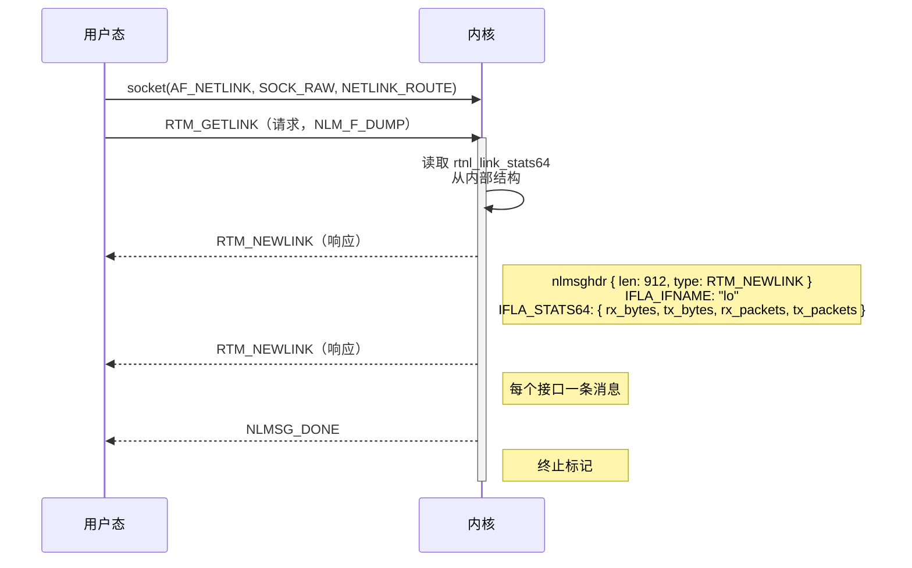
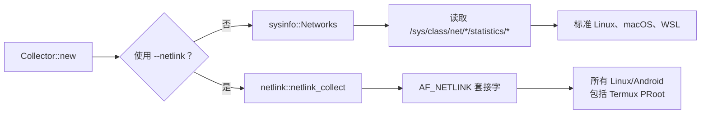

# Linux & Android 网络流量获取：从 sysfs 到 Netlink

> **[📖 English](linux_android_netlink.md)**
> **[📖 简体中文(大陆)](linux_android_netlink.zh-cn.md)**
> **[📖 繁體中文(台灣)](linux_android_netlink.zh-tw.md)**

## TL;DR

Linux 提供了 **两条截然不同的路径** 来读取网络接口流量统计：

1. **sysfs（默认，由 `sysinfo` crate 使用）**—— 读取 `/sys/class/net/<iface>/statistics/*` 文件。遵循"一切皆文件"的哲学。简单、可靠、开箱即用——**但在某些环境下不行**。
2. **Netlink（`--netlink` 参数）**—— 通过 `socket(AF_NETLINK, SOCK_RAW, NETLINK_ROUTE)` 与内核进行**结构化二进制消息**通信。不读文件，不解析字符串。在沙盒环境（如 Termux PRoot）中依然坚挺。

在标准的 Linux 桌面和服务器上，sysfs 完美运行。但在 **Android Termux PRoot 发行版** 和其他受限环境中，`/sys/class/net/` 不可访问，此时 `--netlink` 通过直接与内核路由子系统对话，绕过了整个文件系统。

---

## 路径一：sysfs（"一切皆文件"之道）

### `sysinfo` Crate 在 Linux 上的工作方式

winload 默认使用 [`sysinfo`](https://crates.io/crates/sysinfo) crate。在 Linux 上收集网络统计信息时，`sysinfo` 从 **sysfs** 读取数据——sysfs 是一个虚拟文件系统，它将内核数据结构暴露为常规文件和目录：

```
/sys/class/net/
├── lo/
│   └── statistics/
│       ├── rx_bytes      ← sysinfo 读取
│       ├── tx_bytes      ← sysinfo 读取
│       ├── rx_packets    ← sysinfo 读取
│       ├── tx_packets    ← sysinfo 读取
│       ├── rx_errors     ← sysinfo 读取
│       └── tx_errors     ← sysinfo 读取
├── eth0/
│   └── statistics/
│       └── ...
└── wlan0/
    └── statistics/
        └── ...
```

**精确的调用链：**

```
winload → sysinfo::Networks::refresh()
         → refresh_networks_list_from_sysfs()
           → readdir("/sys/class/net/")
             → 遍历每个接口：
                 read("/sys/class/net/<iface>/statistics/rx_bytes")   → u64
                 read("/sys/class/net/<iface>/statistics/tx_bytes")   → u64
                 read("/sys/class/net/<iface>/statistics/rx_packets") → u64
                 read("/sys/class/net/<iface>/statistics/tx_packets") → u64
                 read("/sys/class/net/<iface>/statistics/rx_errors")  → u64
                 read("/sys/class/net/<iface>/statistics/tx_errors")  → u64
           + refresh_networks_addresses()  → getifaddrs() 获取 MAC/IP
```

来源：sysinfo 仓库中的 `src/unix/linux/network.rs`。

### 为什么说这个设计很优雅

Linux **"一切皆文件"** 的设计哲学意味着内核状态通过和普通文件一样的 `open()` / `read()` 系统调用即可访问。不需要特殊的 ioctl 或复杂的 API——就是普通的文件 I/O。一个 shell 脚本用 `cat` 就能搞定：

```bash
cat /sys/class/net/lo/statistics/rx_bytes
```

内核的网络核心（`net/core/dev.c` 中的 `dev_get_stats()`）维护着每个接口的计数器，存放在 `struct rtnl_link_stats64` 中。当用户态程序读取 sysfs 文件时，内核将对应的 `u64` 计数器即时序列化为 ASCII 文本——没有磁盘 I/O，全是虚拟的。

### 什么时候会失效？

这就到了 **Android 的安全模型** 制造麻烦的地方：

```
App (Termux)
  ↓
PRoot（用户态重定向 root，没有内核级权限）
  ↓
Android SELinux 策略 → 拒绝访问 /sys/class/net/<iface>/statistics/
                      拒绝访问 /proc/net/dev
  ↓
sysinfo 返回空 → 拿不到网络数据！
```

Android 的 SELinux（Security-Enhanced Linux）实施了强制访问控制，阻止非特权进程读取其他进程的网络统计信息。在 **Termux PRoot 发行版** 中情况更糟：PRoot 是一个用户态的 chroot，它不会授予真正的 root 权限——无法绕过 SELinux 的限制。虚拟文件确实存在，但内核拒绝提供数据。

> **🔍 等等，SELinux 究竟是什么？**
>
> 把 SELinux 想象成一个 **铁面无私、只认规章制度的高级安保队长**。他不看你是谁，只看规章上写没写你可以做这件事。
>
> **传统安全模式（DAC）：** 看你的身份通行证。如果你是管理员（Root），你可以在系统里畅行无阻。漏洞在于：如果一个病毒偷到了 Root 的身份，它就能在整个系统里为所欲为。
>
> **SELinux 模式（MAC）：** 给系统里的 *所有东西* 贴上标签。规章上严格写着："允许 [保洁人员] 使用 [拖把] 打扫 [走廊]，仅此而已。" 哪怕保洁阿姨捡到了总经理的通行证，SELinux 也不会让她碰 [总经理保险柜]——因为规章上没写她能碰。这就是 **最小权限原则**：每个程序只得到它工作所需的最小权限，多一点都不给。
>
> 在 Android 上，Termux 被贴上了 [普通第三方应用] 的标签，而 `/sys/class/net/` 里的数据被贴上了 [系统敏感信息] 的标签。当 sysinfo 试图读取这些文件时，SELinux 翻了翻规章，直接一巴掌拍回来："该应用无权读取系统网络统计信息。" —— 数据为零。

即使在标准 Linux 上，类似的问题也会出现在：
- **无权限的 Docker 容器**中，`/sys` 没有被完整挂载
- **严格加固的沙盒环境**中，LSM（Linux Security Module）策略收紧
- **极简的 rootfs 镜像**中，直接省略了 sysfs 挂载

---

## 路径二：Netlink（套接字之道）

> **💡 等等，什么是套接字（Socket）？**
>
> 在深入 Netlink 之前，我们需要先搞清一件事：**什么是套接字？**
>
> 套接字其实就是操作系统给程序提供的一个 **通信端点**——你可以把它想象成一台 **传真机**。
>
> 当你的程序想和网络上的某台服务器（比如百度）说话时，程序向操作系统申请："报告，给我装一台传真机！" 操作系统装好后，给它分配一个号码（IP 地址和端口号），之后程序只需要把数据塞进传真机（`send`），或者等对方发传真过来（`recv`）。底层那些复杂的拉网线、拆包、重传全部由操作系统搞定。
>
> 通常情况下，这台传真机是连接到 *外部世界*（互联网）的。但 Linux 有个巧妙的招数：它允许你把传真机直接连到 *内核本身*。这正是 Netlink 所做的。

### 什么是 Netlink？

**Netlink** 是 Linux 内核原生的一种 IPC（进程间通信）机制，专门为内核与用户态之间的通信而设计。它从 Linux 2.2 开始引入，被现代 Linux 网络工具（`ip`、`NetworkManager`、`systemd-networkd` 等）广泛使用。

可以这样理解：*"如果把内核的网络子系统想象成一台远程服务器，你可以通过套接字来查询它，会怎样？"*

这个想法精妙之处恰恰在于它**不是**"一切皆文件"——而是 **"一切皆网络"**。Linux 把熟悉的 `socket` API——和互联网通信用的是同一个——用在了与内核本身的对话上。内核的路由引擎成了一个可以与之对话的实体。

### Netlink 的工作原理



来源：`winload/rust/src/netlink.rs` —— winload 自带的 netlink 实现。

### 实际代码（winload 的实现）

在 `netlink.rs` 中，winload 做的事情就是：

```rust
// 1. 打开一个原始 netlink 套接字
let fd = socket(AF_NETLINK, SOCK_RAW, 0);

// 2. 构建并发送 RTM_GETLINK dump 请求
let msg = Nlmsghdr { typ: RTM_GETLINK, flags: NLM_F_REQUEST | NLM_F_DUMP, ... };
sendto(fd, &msg, ...);

// 3. 循环接收响应
loop {
    recv(fd, &mut buf, ...);
    for each Nlmsghdr in buf {
        match hdr.typ {
            RTM_NEWLINK => parse(&hdr),
                // 提取 IFLA_IFNAME → 接口名称 ("lo", "eth0", ...)
                // 提取 IFLA_STATS64 → rx_bytes, tx_bytes 作为原始 u64
                // 插入 HashMap<String, Snapshot>
            NLMSG_DONE => break,
        }
    }
}
```

**关键细节：**
- `IFLA_STATS64` 对应内核的 `rtnl_link_stats64` 结构体——和 sysfs 读的是同一个数据源，但以**原始二进制**传输而非格式化文本
- `NLM_F_DUMP` 告诉内核"给我所有接口"（相当于遍历 `/sys/class/net/*/statistics/*`）
- `getifaddrs()` —— 一个 POSIX 函数——被用来同时枚举接口名称和 IPv4/IPv6 地址
- netlink 套接字是**无连接的**——它是一种数据报风格的协议

---

## 对比：sysfs vs Netlink

| 方面 | sysfs（通过 `sysinfo`） | Netlink（`--netlink`） |
|--------|-----------------------|-----------------------|
| **访问方式** | 文件 I/O：`open()` / `read()` | 套接字 I/O：`socket()` / `sendto()` / `recv()` |
| **数据格式** | ASCII 文本（需要字符串解析） | 结构化二进制（零解析） |
| **性能** | 字符串序列化 + 解析开销 | 直接结构体拷贝——更快 |
| **依赖** | 需要挂载 sysfs（`/sys/class/net/`） | 需要内核 `CONFIG_NETLINK`（现代 Linux 中始终开启） |
| **Android Termux** | ❌ 被 SELinux 阻止 | ✅ 正常工作（绕过 VFS） |
| **代码复杂度** | 极简（就是读文件） | 中等（处理二进制协议） |
| **可调试性** | `cat /sys/class/net/lo/statistics/rx_bytes` —— shell 里就能看 | 需要 `ip monitor` 或自定义工具 |

### 为什么两者并存

Linux 设计的美妙之处在于它在**合适的层次提供了选择**：

- **sysfs** 是**便捷路径**：极其简单，人类可读，适合 95% 的使用场景。它体现了 Unix 哲学中"通过文件系统暴露内核状态"的理念。
- **Netlink** 是**强力路径**：更复杂但功能更强。它不依赖文件系统挂载，完全避免了字符串解析，甚至可以在不轮询的情况下异步接收事件通知（如"链路断开"、"IP 地址变更"）——这是 sysfs 做不到的。

这种双路径设计反映了 Linux 架构层面的成熟：简单的事情应该简单，复杂的事情应该可能。

---

## winload 的策略

winload 结合了两种方法以最大化兼容性：



- **默认**——使用 `sysinfo` crate，它读取 sysfs。覆盖绝大多数 Linux 环境。
- **`--netlink`**——完全绕过 sysfs。在 **Android** 上（通过 `#[cfg(any(target_os = "android", target_os = "linux"))]` 编译），这个参数显式切换到原始 RTNETLINK 套接字通信，确保 winload 在 Android Termux、PRoot 发行版、Docker 容器以及 sysfs 不可用的任何受限环境中都能工作。

决定实现自定义 netlink 路径（而不是仅仅依赖 sysinfo）的驱动力来自真实的 Android 测试：在具有严格 SELinux 策略的设备上，即使基于 sysfs 的统计收集也会返回零数据。而 Netlink 在内核的更底层运作，不受文件系统层访问控制的影响。

### 还有哪些类似的方式？

Linux 的设计很巧妙——既然"套接字传真机"这么好用，除了跟网络内核（Netlink）通信，还有哪些地方也用了同样的模式？

- **Unix 域套接字（`AF_UNIX`）**—— 同一台机器上两个程序之间的内部管道。不涉及网络，纯内存到内存的通信。Docker、数据库、systemd 都在用。可以想象成大楼里连接两个办公室的 **气动管道**——快速、安全，外面的人绝对偷听不到。

- **Uevent Netlink（`NETLINK_KOBJECT_UEVENT`）**—— 当你插进一个 U 盘或拔掉一根网线时，内核会通过这个套接字 *广播* 事件消息。系统工具（如 `udev`）监听这个套接字并立刻响应——挂载 U 盘、弹出通知。它就是内核的 **广播大喇叭**。

- **`ioctl`（老式对讲机）**—— 在 Netlink 流行之前，程序用 `ioctl()` 与内核通信。它像一个 **对讲机**：一问一答，但每个驱动程序的暗号（命令码）都不一样，混乱且难以扩展。Netlink 取代了它，因为发送结构化文档（"传真"）比一个一个喊命令要优雅得多。

---

## 延伸阅读

- Linux 内核文档：[rtnetlink(7)](https://man7.org/linux/man-pages/man7/rtnetlink.7.html)、[netlink(7)](https://man7.org/linux/man-pages/man7/netlink.7.html)
- `sysinfo` crate 源码：`src/unix/linux/network.rs` —— 基于 sysfs 的网络统计实现
- winload 的 netlink 源码：`rust/src/netlink.rs` —— 原始 `AF_NETLINK` 实现
- [Linux 内核 `struct rtnl_link_stats64`](https://elixir.bootlin.com/linux/latest/source/include/uapi/linux/if_link.h) —— sysfs 和 netlink 统计数据背后的数据结构