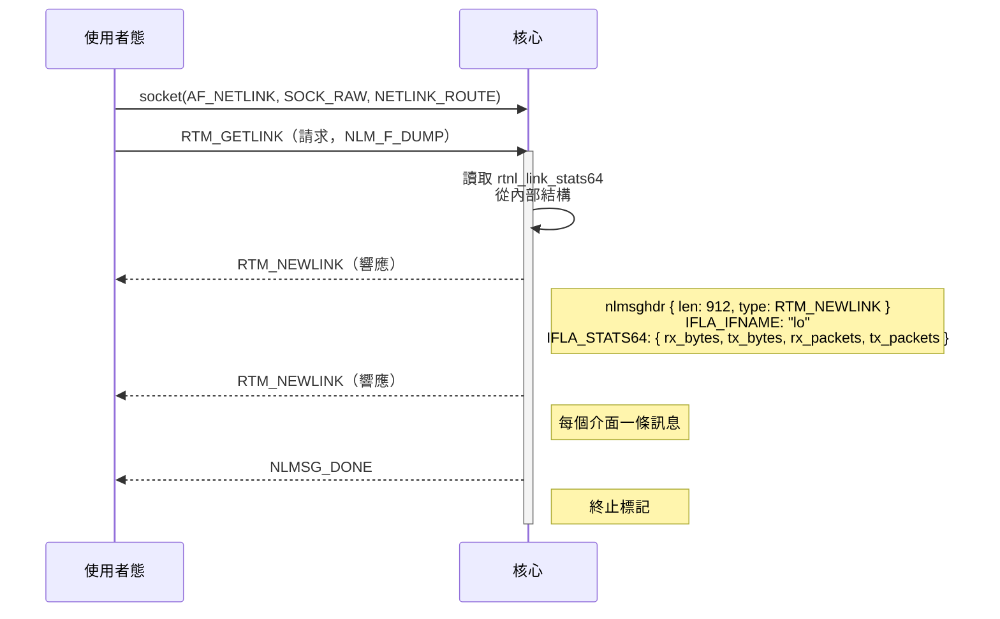
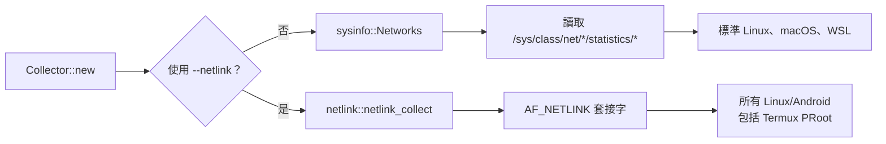

# Linux & Android 網路流量獲取：從 sysfs 到 Netlink

> **[📖 English](linux_android_netlink.md)**
> **[📖 简体中文(大陆)](linux_android_netlink.zh-cn.md)**
> **[📖 繁體中文(台灣)](linux_android_netlink.zh-tw.md)**

## ⚡ TL;DR

Linux 提供了 **兩條截然不同的路徑** 來讀取網路介面流量統計：

1. **sysfs（預設，由 `sysinfo` crate 使用）**—— 讀取 `/sys/class/net/<iface>/statistics/*` 檔案。遵循「一切皆檔案」的哲學。簡單、可靠、開箱即用——**但在某些環境下不行**。
2. **Netlink（`--netlink` 參數）**—— 透過 `socket(AF_NETLINK, SOCK_RAW, NETLINK_ROUTE)` 與核心進行**結構化二進位訊息**通訊。不讀檔案，不解析字串。在沙盒環境（如 Termux PRoot）中依然堅挺。

在標準的 Linux 桌面和伺服器上，sysfs 完美執行。但在 **Android Termux PRoot 發行版** 和其他受限環境中，`/sys/class/net/` 無法存取，此時 `--netlink` 透過直接與核心路由子系統對話，繞過了整個檔案系統。

---

## 📁 路徑一：sysfs（「一切皆檔案」之道）

### `sysinfo` Crate 在 Linux 上的工作方式

winload 預設使用 [`sysinfo`](https://crates.io/crates/sysinfo) crate。在 Linux 上收集網路統計資訊時，`sysinfo` 從 **sysfs** 讀取資料——sysfs 是一個虛擬檔案系統，它將核心資料結構暴露為常規檔案和目錄：

```
/sys/class/net/
├── lo/
│   └── statistics/
│       ├── rx_bytes      ← sysinfo 讀取
│       ├── tx_bytes      ← sysinfo 讀取
│       ├── rx_packets    ← sysinfo 讀取
│       ├── tx_packets    ← sysinfo 讀取
│       ├── rx_errors     ← sysinfo 讀取
│       └── tx_errors     ← sysinfo 讀取
├── eth0/
│   └── statistics/
│       └── ...
└── wlan0/
    └── statistics/
        └── ...
```

**精確的呼叫鏈：**

```
winload → sysinfo::Networks::refresh()
         → refresh_networks_list_from_sysfs()
           → readdir("/sys/class/net/")
             → 遍歷每個介面：
                 read("/sys/class/net/<iface>/statistics/rx_bytes")   → u64
                 read("/sys/class/net/<iface>/statistics/tx_bytes")   → u64
                 read("/sys/class/net/<iface>/statistics/rx_packets") → u64
                 read("/sys/class/net/<iface>/statistics/tx_packets") → u64
                 read("/sys/class/net/<iface>/statistics/rx_errors")  → u64
                 read("/sys/class/net/<iface>/statistics/tx_errors")  → u64
           + refresh_networks_addresses()  → getifaddrs() 獲取 MAC/IP
```

來源：sysinfo 倉庫中的 `src/unix/linux/network.rs`。

### 為什麼說這個設計很優雅

Linux **「一切皆檔案」** 的設計哲學意味著核心狀態透過和普通檔案一樣的 `open()` / `read()` 系統呼叫即可存取。不需要特殊的 ioctl 或複雜的 API——就是普通的檔案 I/O。一個 shell 指令碼用 `cat` 就能搞定：

```bash
cat /sys/class/net/lo/statistics/rx_bytes
```

核心的網路核心（`net/core/dev.c` 中的 `dev_get_stats()`）維護著每個介面的計數器，存放在 `struct rtnl_link_stats64` 中。當使用者態程式讀取 sysfs 檔案時，核心將對應的 `u64` 計數器即時序列化為 ASCII 文字——沒有磁碟 I/O，全是虛擬的。

### 什麼時候會失效？

這就到了 **Android 的安全模型** 製造麻煩的地方：

```
App (Termux)
  ↓
PRoot（使用者態重定向 root，沒有核心級權限）
  ↓
Android SELinux 策略 → 拒絕存取 /sys/class/net/<iface>/statistics/
                      拒絕存取 /proc/net/dev
  ↓
sysinfo 回傳空 → 拿不到網路資料！
```

Android 的 SELinux（Security-Enhanced Linux）實施了強制存取控制，阻止非特權程式讀取其他程式的網路統計資訊。在 **Termux PRoot 發行版** 中情況更糟：PRoot 是一個使用者態的 chroot，它不會授予真正的 root 權限——無法繞過 SELinux 的限制。虛擬檔案確實存在，但核心拒絕提供資料。

> **🔍 等等，SELinux 究竟是什麼？**
>
> 把 SELinux 想像成一個 **鐵面無私、只認規章制度的高級安保管制**。他不看你是誰，只看規章上有沒有寫你可以做這件事。
>
> **傳統安全模式（DAC）：** 看你的身份通行證。如果你是管理員（Root），你可以在系統裡暢行無阻。漏洞在於：如果一個病毒偷到了 Root 的身份，它就能在整個系統裡為所欲為。
>
> **SELinux 模式（MAC）：** 給系統裡的 *所有東西* 貼上標籤。規章上嚴格寫著："允許 [清潔人員] 使用 [拖把] 打掃 [走廊]，僅此而已。" 就算清潔阿姨撿到了總經理的通行證，SELinux 也不會讓她碰 [總經理保險箱]——因為規章上沒寫她能碰。這就是 **最小權限原則**：每個程式只得到它工作所需的最小權限，多一點都不給。
>
> 在 Android 上，Termux 被貼上了 [普通第三方應用] 的標籤，而 `/sys/class/net/` 裡的資料被貼上了 [系統敏感資訊] 的標籤。當 sysinfo 試圖讀取這些檔案時，SELinux 翻了翻規章，直接一巴掌拍回來："該應用無權讀取系統網路統計資訊。" —— 資料為零。

即使在標準 Linux 上，類似的問題也會出現在：
- **無權限的 Docker 容器**中，`/sys` 沒有被完整掛載
- **嚴格加固的沙盒環境**中，LSM（Linux Security Module）策略收緊
- **極簡的 rootfs 映像檔**中，直接省略了 sysfs 掛載

---

## 🔌 路徑二：Netlink（套接字之道）

> **💡 等等，什麼是套接字（Socket）？**
>
> 在深入 Netlink 之前，我們需要先搞清一件事：**什麼是套接字？**
>
> 套接字其實就是作業系統給程式提供的一個 **通訊端點**——你可以把它想像成一台 **傳真機**。
>
> 當你的程式想和網路上的某台伺服器（比如 Google）說話時，程式向作業系統申請：「報告，給我裝一台傳真機！」 作業系統裝好後，給它分配一個號碼（IP 位址和連接埠號），之後程式只需要把資料塞進傳真機（`send`），或者等對方發傳真過來（`recv`）。底層那些複雜的拉網路線、拆封包、重傳全部由作業系統搞定。
>
> 通常情況下，這台傳真機是連接到 *外部世界*（網際網路）的。但 Linux 有個巧妙的招數：它允許你把傳真機直接連到 *核心本身*。這正是 Netlink 所做的。

### 什麼是 Netlink？

**Netlink** 是 Linux 核心原生的一種 IPC（行程間通訊）機制，專門為核心與使用者態之間的通訊而設計。它從 Linux 2.2 開始引入，被現代 Linux 網路工具（`ip`、`NetworkManager`、`systemd-networkd` 等）廣泛使用。

可以這樣理解：*「如果把核心的網路子系統想像成一台遠端伺服器，你可以透過套接字來查詢它，會怎樣？」*

這個想法精妙之處恰恰在於它**不是**「一切皆檔案」——而是 **「一切皆網路」**。Linux 把熟悉的 `socket` API——和網際網路通信用的是同一個——用在了與核心本身的對話上。核心的路由引擎成了一個可以與之對話的實體。

### Netlink 的工作原理



來源：`winload/rust/src/netlink.rs` —— winload 自帶的 netlink 實作。

### 實際程式碼（winload 的實作）

在 `netlink.rs` 中，winload 做的事情就是：

```rust
// 1. 開啟一個原始 netlink 套接字
let fd = socket(AF_NETLINK, SOCK_RAW, 0);

// 2. 構建並發送 RTM_GETLINK dump 請求
let msg = Nlmsghdr { typ: RTM_GETLINK, flags: NLM_F_REQUEST | NLM_F_DUMP, ... };
sendto(fd, &msg, ...);

// 3. 迴圈接收響應
loop {
    recv(fd, &mut buf, ...);
    for each Nlmsghdr in buf {
        match hdr.typ {
            RTM_NEWLINK => parse(&hdr),
                // 提取 IFLA_IFNAME → 介面名稱 ("lo", "eth0", ...)
                // 提取 IFLA_STATS64 → rx_bytes, tx_bytes 作為原始 u64
                // 插入 HashMap<String, Snapshot>
            NLMSG_DONE => break,
        }
    }
}
```

**關鍵細節：**
- `IFLA_STATS64` 對應核心的 `rtnl_link_stats64` 結構體——和 sysfs 讀的是同一個資料來源，但以**原始二進位**傳輸而非格式化文字
- `NLM_F_DUMP` 告訴核心「給我所有介面」（相當於遍歷 `/sys/class/net/*/statistics/*`）
- `getifaddrs()` —— 一個 POSIX 函式——被用來同時列舉介面名稱和 IPv4/IPv6 位址
- netlink 套接字是**無連接的**——它是一種資料報風格的協定

---

## ⚖️ 對比：sysfs vs Netlink

| 方面 | sysfs（透過 `sysinfo`） | Netlink（`--netlink`） |
|--------|-----------------------|-----------------------|
| **存取方式** | 檔案 I/O：`open()` / `read()` | 套接字 I/O：`socket()` / `sendto()` / `recv()` |
| **資料格式** | ASCII 文字（需要字串解析） | 結構化二進位（零解析） |
| **效能** | 字串序列化 + 解析開銷 | 直接結構體拷貝——更快 |
| **依賴** | 需要掛載 sysfs（`/sys/class/net/`） | 需要核心 `CONFIG_NETLINK`（現代 Linux 中始終開啟） |
| **Android Termux** | ❌ 被 SELinux 阻止 | ✅ 正常運作（繞過 VFS） |
| **程式碼複雜度** | 極簡（就是讀檔案） | 中等（處理二進位協定） |
| **可偵錯性** | `cat /sys/class/net/lo/statistics/rx_bytes` —— shell 裡就能看 | 需要 `ip monitor` 或自訂工具 |

### 為什麼兩者並存

Linux 設計的美妙之處在於它在**合適的層次提供了選擇**：

- **sysfs** 是**便捷路徑**：極其簡單，人類可讀，適合 95% 的使用場景。它體現了 Unix 哲學中「透過檔案系統暴露核心狀態」的理念。
- **Netlink** 是**強力路徑**：更複雜但功能更強。它不依賴檔案系統掛載，完全避免了字串解析，甚至可以在不輪詢的情況下非同步接收事件通知（如「鏈路中斷」、「IP 位址變更」）——這是 sysfs 做不到的。

這種雙路徑設計反映了 Linux 架構層面的成熟：簡單的事情應該簡單，複雜的事情應該可能。

---

## 🧭 winload 的策略

winload 結合了兩種方法以最大化相容性：



- **預設**——使用 `sysinfo` crate，它讀取 sysfs。涵蓋絕大多數 Linux 環境。
- **`--netlink`**——完全繞過 sysfs。在 **Android** 上（透過 `#[cfg(any(target_os = "android", target_os = "linux"))]` 編譯），這個參數顯式切換到原始 RTNETLINK 套接字通訊，確保 winload 在 Android Termux、PRoot 發行版、Docker 容器以及 sysfs 不可用的任何受限環境中都能運作。

決定實作自訂 netlink 路徑（而不是僅僅依賴 sysinfo）的驅動力來自真實的 Android 測試：在具有嚴格 SELinux 政策的裝置上，即使基於 sysfs 的統計收集也會回傳零資料。而 Netlink 在核心的更底層運作，不受檔案系統層存取控制的影響。

### 還有哪些類似的方式？

Linux 的設計很巧妙——既然「套接字傳真機」這麼好用，除了跟網路核心（Netlink）通訊，還有哪些地方也用了同樣的模式？

- **Unix 域套接字（`AF_UNIX`）**—— 同一臺機器上兩個程式之間的內部管道。不涉及網路，純記憶體到記憶體的通訊。Docker、資料庫、systemd 都在用。可以想像成大樓裡連接兩個辦公室的 **氣動管道**——快速、安全，外面的人絕對偷聽不到。

- **Uevent Netlink（`NETLINK_KOBJECT_UEVENT`）**—— 當你插進一個 USB 隨身碟或拔掉一條網路線時，核心會透過這個套接字 *廣播* 事件訊息。系統工具（如 `udev`）監聽這個套接字並立刻響應——掛載隨身碟、彈出通知。它就是核心的 **廣播大聲公**。

- **`ioctl`（老式對講機）**—— 在 Netlink 流行之前，程式用 `ioctl()` 與核心通訊。它像一個 **對講機**：一問一答，但每個驅動程式的暗號（命令碼）都不一樣，混亂且難以擴展。Netlink 取代了它，因為傳送結構化文件（「傳真」）比一個一個喊命令要優雅得多。

---

## 📚 延伸閱讀

- Linux 核心文件：[rtnetlink(7)](https://man7.org/linux/man-pages/man7/rtnetlink.7.html)、[netlink(7)](https://man7.org/linux/man-pages/man7/netlink.7.html)
- `sysinfo` crate 源碼：`src/unix/linux/network.rs` —— 基於 sysfs 的網路統計實作
- winload 的 netlink 源碼：`rust/src/netlink.rs` —— 原始 `AF_NETLINK` 實作
- [Linux 核心 `struct rtnl_link_stats64`](https://elixir.bootlin.com/linux/latest/source/include/uapi/linux/if_link.h) —— sysfs 和 netlink 統計資料背後的資料結構
