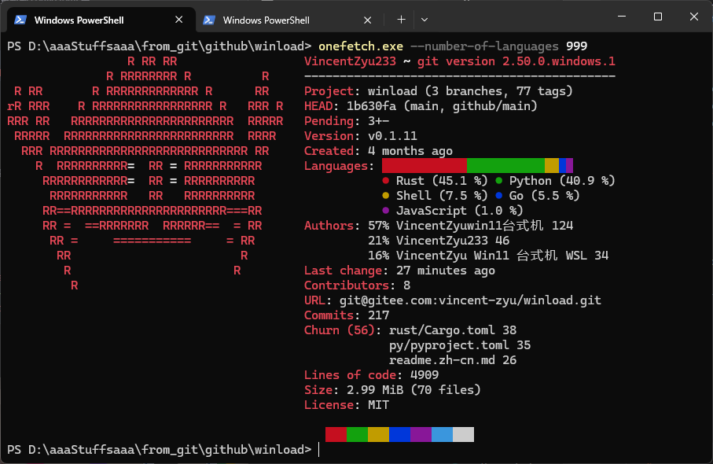

# Winload 

> Linuxの「nload」にインスパイアされた、軽量でリアルタイムなネットワーク帯域幅およびトラフィック監視用CLIツールです。

> **[📖 English](readme.md)**
> **[📖 简体中文(大陆)](readme.zh-cn.md)**
> **[📖 繁體中文(台灣)](readme.zh-tw.md)**
> **[📖 文言文](readme.lzh.md)**
> **[📖 日本語](readme.jp.md)**
> **[📖 한국어](readme.ko.md)**

[](https://github.com/VincentZyuApps/winload)
[](https://gitee.com/vincent-zyu/winload)

[](https://github.com/VincentZyuApps/winload/releases)
[](https://github.com/VincentZyuApps/winload/releases)
[](https://github.com/VincentZyuApps/winload/releases)
[](https://github.com/VincentZyuApps/winload/releases)

[](https://pypi.org/project/winload/)
[](https://pypi.org/project/winload/)

[](https://crates.io/crates/winload)

[](https://www.npmjs.com/package/@vincentzyuapps/winload)

[](https://scoop.sh/#/apps?q=%22https%3A%2F%2Fgithub.com%2FVincentZyuApps%2Fscoop-bucket%22&o=false)
[](https://aur.archlinux.org/packages/winload-rust-bin)
[](https://github.com/VincentZyuApps/winload/releases)
[](https://github.com/VincentZyuApps/winload/releases)
[![Homebrew](https://img.shields.io/badge/Homebrew-FBB040?style=for-the-badge&logo=data%3Aimage%2Fpng%3Bbase64%2CiVBORw0KGgoAAAANSUhEUgAAACAAAAAgCAMAAABEpIrGAAABIFBMVEXjojpVVVU0NTYKD2ZeX18uLS1nUzSccjT%2F9IudnZ34zZzV1dWVaWb%2Fyme5hzk4PkY5QEfo6utiYF6Pgm89QkI5SWS%2Bv8D%2Fu1H%2FwF38wmkuLi5%2FgIAvb88AAJEkLkJpaWkuLCySk5RFQj9GOyxBOCsAAAD8s0L5rTtIR0bW2NlUVFRXWFn%2F%2F%2F%2F%2FtDv7wWI7Ozv%2F4Jc8PDxJSUt%2Bfn77xnpmZmYNDQ14dnFHR0iLhHs7OzrIystWVlWqq6x0dXX1rUFlZWU3PUY4ODdZWVlFRkZiYmL%2FwkpTVViJiotoaGg1NTW3uLlQUVMkJCRjY2Lo6utbW1tmZmYqKimYmJgnKi86OjtOXGv%2B3ZJJSUmBfnT%2F6Ij%2BulKGhoZERUX7uln%2F3IiiD4zCAAAAYHRSTlP%2BMtgYsU7T%2F0kSFgYccf6mmv7SKTJM%2F5yc0Dz8EA5Ndp%2F%2FpMSUAP79sv0EqwTR%2FG3%2BBG8LU0lESY9PqP%2FS%2Ffr9m5op8cUs%2FVn9%2BpT%2Fcwyt%2B48YdgxIyDP%2BUFA0tD39yE55c4A0AAABtUlEQVR42rXTV1fbMBQAYCchiw3dE2h75StbSYid1K5XiO3svYAy%2F%2F%2B%2FQHGhsQ3pW%2FXgo3P0Hd3hKwH%2BLuyqUIb4ElZby7YSkJ6sA2UwTNO%2F9JCVXwYSuJ2DT0nn4%2FoQg2PH7pxBYrAGTL22d9tZWG2nO2PPgATTNqUj0%2BxRemBjXo0BFVxnRKlJgzVqp1f1Co8l6CdOpxcc92yTYhwAJJOua7zt2dTp9n3bY%2FEclEUDoHrbnXoGD%2BhbKEXBa2PGVFXrA5RaUhkYXGIUzPXldxsGTz1oxMDMUKqfV7WfK%2Bg%2BpfmYw9YCM5kfen%2F%2BlaeHmNTyW%2FEyXxWKNUHYzX5jqWxOGcrYCgMJUCucFgVCmtk3qd0cbCcmfgNYCMha4aIo1kQiZr4LufqG1VLSkRv%2BAEJqRBSblT3QhqWfUfCLh%2BCAC0Iq%2B5vVs3WAEJFU6uy%2Fg314BjYiYO%2FmaPwvcN8ayhN9Hg3xO3zDckL8fBxckKAPNbF5Xzd0XQ06HerkdZMfC8sr7jYxPnIc3MDVzvvrD3fvdq74D%2Bdjz6JDq2D%2F%2FEuwS%2FFxKb3wshJjGY1D6xBRHjdCT%2B8BOSqpSBALHToAAAAASUVORK5CYII%3D)](https://github.com/VincentZyuApps/homebrew-tap/blob/main/Formula/winload.rb)

> **[📖 ビルドドキュメント](.github/workflows/build.md)**

## 🚀 はじめに
`Winload`は、直感的で視覚的なネットワークモニターをモダンなターミナルにもたらします。もともとはWindowsにおける`nload`の代替ツールとして開発が始まりましたが、現在はLinuxやmacOSもサポートしています。

## 🙏 謝辞
Winloadは、Roland Riegel氏によるクラシックなプロジェクト「[nload](https://github.com/rolandriegel/nload)」にインスパイアされています。素晴らしいアイデアとユーザー体験に深く感謝いたします。
https://github.com/rolandriegel/nload

## ✨ 主な特徴
- **2つの実装エディション**
	- **Rust版**: 高速、メモリ安全、単一の静的バイナリ。日常的な監視に最適です。
	- **Python版**: プロトタイプ作成や統合のために、ハックや拡張が容易です。
- **クロスプラットフォーム**: Windows、Linux、macOS (x64 & ARM64) に対応。
- **リアルタイムの可視化**: 送受信トラフィックのライブグラフとスループット統計を表示。
- **ミニマルなUI**: nloadの使い勝手を踏襲したクリーンなTUI（テキストユーザインターフェース）。

## 📊 パフォーマンスベンチマーク
> ⚡ Winload (Rust) は **~10ms の起動時間** と **2MB未満のバイナリサイズ** を達成し、Python版を大幅に上回り、C++製 nload と同等の効率を実現しています。



## 🔧 ソースから実行

### Python
```bash
git clone https://github.com/VincentZyuApps/winload.git
# または Gitee からクローン（中国本土で高速）：
# git clone https://gitee.com/vincent-zyu/winload.git
cd winload/python
uv run python -m winload
```

### Rust
```bash
git clone https://github.com/VincentZyuApps/winload.git
cd winload/rust
cargo run --release
cargo run --release -- --help    # ヘルプを表示
cargo run --release -- --version # バージョンを表示
```

## 🐍 Python 版 インストール
> 💡 **実装に関する注記**: PyPI および GitHub/Gitee のソースコードのみが Python 版です。  
> Cargo のみが Rust ソースコードのローカルビルドを提供します。  
> すべて他方のパッケージマネージャー（Scoop、AUR、npm、APT、RPM）および GitHub Releases は **Rust バイナリ** を提供しています。
### Python (pip)
```bash
pip install winload
# uv の使用を推奨：
# https://docs.astral.sh/uv/getting-started/installation/
# https://gitee.com/wangnov/uv-custom/releases
uv venv --python 3.13
uv pip install winload
uv run python -c "import shutil; print(shutil.which('winload'))"
uv run winload
```

## 📥 Rust 版 インストール（推奨）
### npm (クロスプラットフォーム)
```bash
# 推奨（scoped）
npm install -g @vincentzyuapps/winload
# 代替（unscoped）
npm install -g winload-rust-bin
# 代替（GitHub Packages）
npm install -g @vincentzyuapps/winload --registry https://npm.pkg.github.com
# Windows では System32\winload.exe との競合を避けるため win-nload を使用
# Linux/macOS では winload と win-nload のどちらも使用可能
# または npx を直接使用
npx @vincentzyuapps/winload
```

> 4つのプリコンパイル済みバイナリを含む：x86_64 & ARM64 対応、Windows・Linux・macOS に対応。

### Cargo (ソースからビルド)
```bash
cargo install winload
cargo install --list
```
### Windows (Scoop)
> 📄 [Scoop Bucket (GitHub)](https://github.com/VincentZyuApps/scoop-bucket/blob/main/bucket/winload.json)
> 📄 [Scoop Bucket (Gitee)](https://gitee.com/vincent-zyu/scoop-bucket/blob/main/bucket/winload.json)
```powershell
scoop bucket add vincentzyu https://github.com/VincentZyuApps/scoop-bucket
# または Gitee から：
# scoop bucket add vincentzyu https://gitee.com/vincent-zyu/scoop-bucket
scoop update   # optional: インストール前に bucket を手動更新
scoop install winload
# バイナリファイルを実行
win-nload
Get-Command win-nload # Powershell
where win-nload # CMD
```
> 💡 レガシーの Windows Console ではなく、[Windows Terminal](https://github.com/microsoft/terminal) の使用を推奨します。CJK 文字の正確なレンダリングとより良い TUI 体験が得られます。
> ```powershell
> scoop bucket add versions
> scoop install windows-terminal-preview
> wtp
> ```
> 💡 **すべてのビルドに Windows 10+ が必要です**（Rust 1.77+ は Windows 7/8 をサポートしなくなりました）。Scoop と npm は既定で **x86_64** および **ARM64** 向けの **MSVC + Npcap** ビルドを提供します。これらのビルドは `wpcap.dll` を遅延読み込みするようになったため、`--npcap` を使う前の起動失敗リスクは下がりましたが、ループバック取得には引き続きシステムに Npcap が必要です。

### Arch Linux (AUR):
```bash
paru -S winload-rust-bin
which winload
```

### Debian & RedHat 系ディストロ / Termux (ワンライナー)
> Debian/Ubuntu およびその派生版（Linux Mint, Pop!_OS, Deepin, UOS等）をサポート (apt)

> Fedora/RHEL およびその派生版（Rocky Linux, AlmaLinux, CentOS Stream等）をサポート (dnf)

> Android の Termux (aarch64) もサポート

```bash
curl -fsSL https://raw.githubusercontent.com/VincentZyuApps/winload/main/docs/scripts/install/install.sh | bash
which winload
```
> 📄 [インストールスクリプトのソースを表示](https://github.com/VincentZyuApps/winload/blob/main/docs/scripts/install/install.sh)

**🇨🇳 Giteeミラー（中国本土内での高速ダウンロード）：**
```bash
curl -fsSL https://gitee.com/vincent-zyu/winload/raw/main/docs/scripts/install/install_gitee.sh | bash
which winload
```
> 📄 [Giteeインストールスクリプトを表示](https://gitee.com/vincent-zyu/winload/blob/main/docs/scripts/install/install_gitee.sh)

> ⚠️ 上記の2つの `curl ... | bash` インストールスクリプトは、**x86_64 / aarch64** アーキテクチャ上で **apt**（Debian/Ubuntu）、**dnf**（Fedora/RHEL）、または **Termux**（Android）を使用するシステムをサポートしています。その他のプラットフォームでは **npm**（`npm install -g @vincentzyuapps/winload`）または **Cargo**（`cargo install winload`）をご利用ください。

### macOS / Linux（Homebrew）
> 📄 [Homebrew Formula (GitHub)](https://github.com/VincentZyuApps/homebrew-tap/blob/main/Formula/winload.rb)
> 📄 [Homebrew Formula (Gitee)](https://gitee.com/vincent-zyu/homebrew-tap/blob/main/Formula/winload.rb)
> 最近の Homebrew では、インストール前にサードパーティ tap の formula を信頼する必要がある場合があります。
```bash
brew tap vincentzyuapps/tap
brew trust vincentzyuapps/tap
# または Gitee から（手動クローン）：
# git clone https://gitee.com/vincent-zyu/homebrew-tap.git "$(brew --prefix)/Library/Taps/vincentzyuapps/homebrew-tap"
brew update && brew install winload
which winload
```
> 💡 Homebrew は **macOS**（Intel および Apple Silicon）と **Linux**（x86_64 および ARM64）をサポートしています。

<details>
<summary>手動インストール</summary>

**DEB (Debian/Ubuntu):**
```bash
# GitHub Releasesから最新の .deb をダウンロード
sudo dpkg -i ./winload*.deb
# または apt を使用（依存関係を自動解決）
sudo apt install ./winload*.deb
which winload
```

**RPM (Fedora/RHEL):**
```bash
sudo dnf install ./winload*.rpm
which winload
```

**または、[GitHub Releases](https://github.com/VincentZyuApps/winload/releases) からバイナリを直接ダウンロードしてください。**

</details>

## ⌨️ 使い方

```bash
winload              # すべてのアクティブなネットワークインターフェースを監視
winload -t 200       # 更新間隔を200ミリ秒に設定
winload -d "Wi-Fi"   # 特定のデバイス名で開始
winload --title "My Monitor" # カスタムヘッダータイトルを使う
winload -e           # 絵文字装飾を有効にする 🎉
winload --max-mode smart --max-half-life 10 # スムーズな適応型 Y 軸（既定）
winload --max-mode legacy # nload 風の表示履歴ピークスケーリング
winload --max-mode fixed --max-y-value 10M # Y 軸上限を固定
winload --npcap      # 127.0.0.1 ループバックトラフィックをキャプチャ (Windows, Npcapが必要)
winload --netlink    # RTNETLINK を手動で有効化（Linux/Android、既定はオフ）
```

### オプション

| フラグ | 説明 | デフォルト |
|------|-------------|---------|
| `-t`, `--interval <MS>` | 更新間隔（ミリ秒） | `500` |
| `-a`, `--average <SEC>` | 平均値計算のウィンドウ時間（秒） | `300` |
| `-d`, `--device <NAME>` | デフォルトのデバイス名（部分一致可） | — |
| `--title [TITLE]` | デバイスヘッダーの上にタイトル行を追加。値なしは `winload <version>`、空文字列（または省略）は既定のデバイスヘッダーのみ表示 | — |
| `-e`, `--emoji` | TUIで絵文字装飾を有効にする 🎉 | オフ |
| `-U`, `--unicode` | グラフにUnicodeブロック文字を使用 (█▓░·) | オフ |
| `-u`, `--unit <UNIT>` | 表示単位: `bit` または `byte` | `bit` |
| `-b`, `--bar-style <STYLE>` | バースタイル: `fill`, `color`, `plain` | `plain` |
| `--in-color <HEX>` | 受信グラフの色、16進数RGB (例: `0x00d7ff`) | シアン |
| `--out-color <HEX>` | 送信グラフの色、16進数RGB (例: `0xffaf00`) | ゴールド |
| `--max-mode <MODE>` | Y 軸スケーリングモード：`smart`、`legacy`、`fixed` | `smart` |
| `--max-half-life <SECS>` | smart モードの指数減衰半減期 | `10` |
| `--max-y-value <VALUE>` | fixed モードの Y 軸上限（例：`10M`、`1G`、`500K`） | — |
| `-n`, `--no-graph` | グラフを非表示にし、統計のみを表示 | オフ |
| `--hide-separator` | 区切り線（イコール記号の行）を非表示にする | オフ |
| `--no-color` | すべてのTUIカラーを無効にする（モノクロモード） | オフ |
| `--npcap` | **[Windows Rust Only]** Npcap経由でループバックをキャプチャ | オフ |
| `--netlink` | **[Linux/Android Only]** RTNETLINK を既定バックエンドの代わりに使用（Termux proot distro や制限された環境向け） | オフ |
| `--debug-info` | インターフェースのデバッグ情報を表示して終了 | — |
| `-h`, `--help` | ヘルプを表示 (`--help --emoji` で絵文字版ヘルプ！) | — |
| `-V`, `--version` | バージョンを表示 | — |

> **Y軸スケーリングモード**
>
> | モード | フラグ | 動作 |
> |--------|--------|------|
> | **smart** | `--max-mode smart --max-half-life 10` | 既定。スパイク時に上昇し、その後スムーズに指数減衰します。 |
> | **legacy** | `--max-mode legacy` | nload 風に、表示中のグラフ履歴ピークで自動スケーリングします。 |
> | **fixed** | `--max-mode fixed --max-y-value 10M` | Y 軸を指定値に固定します。 |
>
> `--max-y-value` は `--max-mode fixed` 専用、`--max-half-life` は `--max-mode smart` 専用です。

### キーボードショートカット

| キー | アクション |
|-----|--------|
| `←` / `→` または `↑` / `↓` | ネットワークデバイスを切り替える |
| `F3` | デバッグ情報オーバーレイの切り替え（Minecraft 風） |
| `=` | 区切り線の表示/非表示を切り替える |
| `c` | カラーのオン/オフを切り替える |
| `q` / `Esc` | 終了 |

## 🪟 Windows ループバック (127.0.0.1) について

Windowsの標準的なAPIでは、ループバックトラフィックを正しく報告できません。これは[Windowsのネットワークスタックにおける機能的な制限](docs/win_loopback.md)によるものです。

**Windowsでループバックトラフィックをキャプチャする場合**は、`--npcap` フラグを使用してください：

```bash
winload --npcap
```

これには、セットアップ時に「Support loopback traffic capture（ループバックトラフィックキャプチャのサポート）」を有効にして [Npcap](https://npcap.com/#download) をインストールする必要があります。

> 以前、Windows独自の `GetIfEntry` APIを直接ポーリングする方法を試みましたが、ループバックのカウンタは常に0でした。ループバックの疑似インターフェースの背後には、カウントを行うためのNDISドライバが存在しないためです。そのため、そのコードパスは削除されました。

> 📖 なぜWindowsのループバックが制限されているのかについての詳細は、[docs/win_loopback.md](docs/win_loopback.md) を参照してください。

## 🐧 Linux / Android / Termux Netlink

LinuxおよびmacOSでは、ループバックトラフィックは追加のフラグなしで標準で動作します。

**Linux/Android** で `/proc/net/dev` にアクセスできない場合（Termux proot distro やその他の制限された環境など）、`--netlink` を使用して RTNETLINK 経由でネットワーク統計を直接収集できます：

```bash
winload --netlink
```

> 注：`--netlink` は `--npcap` と同じく**手動で有効化する任意のバックエンド**で、フラグを渡さない限り有効になりません。通常の Linux/Android では既定バックエンド（Rust: sysinfo、Python: psutil）を使用します。Python 版は Linux/Android 上で `pyroute2` により RTNETLINK を使用します。macOS では netlink は利用できません。
>
> 📖 Linux/Android ネットワーク統計収集の詳細は、[docs/linux_android_netlink.md](docs/linux_android_netlink.md) を参照してください

## 🖼️ プレビュー
#### Python版 プレビュー


#### Rust版 プレビュー


##### Rust版 プレビュー GIF


##### ターミナル録画
[](https://asciinema.org/a/1030894?t=30)

> ↑ [asciinema](https://github.com/asciinema/asciinema) で録画

## 📦 依存関係

### Python版

| パッケージ | バージョン | 説明 |
|:---|:---|:---|
| [](https://python.org/) | 3.13.11 | プログラミング言語 |
| [](https://github.com/giampaolo/psutil) | ≥7.0 | プロセス・システムユーティリティ |
| [](https://github.com/svinota/pyroute2) | ≥0.9.6 | Linux/Android の RTNETLINK バックエンド |
| [](https://github.com/zhirui2020/windows-curses) | ≥2.0 | Windows カーサポート |

### Rust版

| パッケージ | バージョン | 説明 |
|:---|:---|:---|
| [](https://www.rust-lang.org/) | 1.93.0 | プログラミング言語 |
| [](https://github.com/ratatui-org/ratatui) | 0.29 | ターミナルUIフレームワーク |
| [](https://github.com/crossterm-rs/crossterm) | 0.28 | クロスプラットフォームターミナルライブラリ |
| [](https://github.com/GuillaumeGomez/sysinfo) | 0.32 | システム情報ライブラリ |
| [](https://github.com/clap-rs/clap) | 4 | コマンドライン引数パーサー |
| [](https://github.com/pcap-parser/pcap) | 2 | パケットキャプチャ（オプション、Windows） |
## 🧭 結語

ネットの流れは形なく、Winload はそれに姿を与える。パケットは端末を行き交い、音もなく、気配もない。しかし、その一つひとつの行き来を、余すところなく目の当たりにすることができる。一つのマシンのネットワークの鼓動を知りたいとき、この道具は机の上の小さな灯火となり、夜を渡る船の星となるのである。

